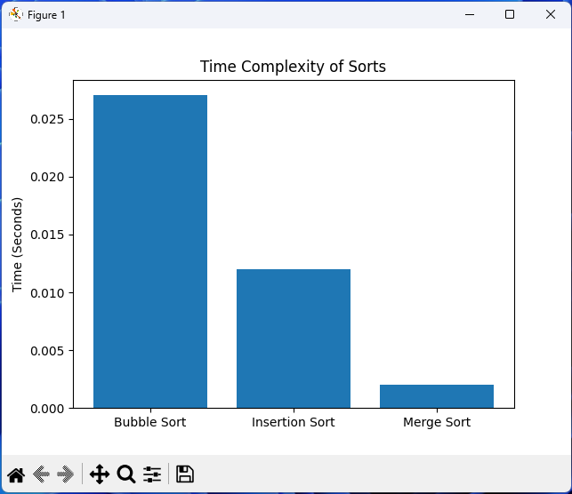

# About
Designed and created an original time complexity data visualization Python program.
Measures performance of key sorting algorithms (Bubble Sort, Insertion Sort and Merge Sort)
Implements stand-out features such as database generation, adding data to the database using SQL queries in SQLite3, .db file to .csv file converter, file manipulation and more. All listed in Features section.

# Features
- Generating databases (.db files)
- Converting .db file type to .csv
- Bubble Sort Algorithm 
- Insertion Sort Algorithm
- Merge Sort Algorithm
- Tracks performance of each algorithm by timing how much time sorts take
- Displaying Time Complexity on a graph using matplotlib

# Preview
For this demonstration, I created a database with 1000 items consisting of digitis only, converted it into a csv file, performed all sorts and plotted the results on a simple to read graph.



# Skills Developed
- File Manipulation
- Working with Databases and CSV files
- SQL Queries with SQLite3
- Coding Sorting Algorithms (Bubble Sort, Insertion Sort and Merge Sort)
- Measuring Performance using time
- Plotting data using matplotlib library
- Intuitive User Interface

# Key Libraries
- SQLite3
- matplotlib

## Project Structure
```
/Project
 ├──main.py
 ├──Database.db
 ├──list.csv
```
