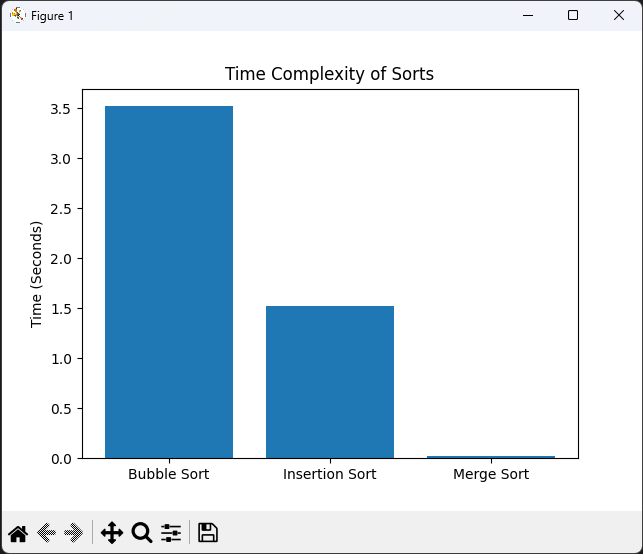

# About
Designed and created an original time complexity data visualization Python program.

Measures performance of key sorting algorithms (Bubble Sort, Insertion Sort and Merge Sort)

Implements stand-out features such as database generation, adding data to the database using SQL queries in SQLite3, .db file to .csv file converter, file manipulation and more. All listed in the features section.

# Features
- Generating databases (.db files)
- Converting .db file type to .csv
- Bubble Sort Algorithm 
- Insertion Sort Algorithm
- Merge Sort Algorithm
- Tracks performance of each algorithm by timing how much time sorts take
- Displaying Time Complexity on a graph using matplotlib

# Preview
For this demonstration, I created a database with 10000 items consisting of letters only, converted it into a csv file, performed all sorts and plotted the results on a simple to read graph.

<p align="center">
  
</p>

# How to run
### Prerequisites
- Python 3.10+
- Matplotlib Library (Install using: 'pip install matplotlib')

### Steps
- Clone the repository or just the main.py file
- Run The Program

### Notes
- You may upload your own database or csv file
- Example database and CSV file has been attached in the repository if needed.
- The program itself also allows you to create a database of randomly generated digits or characters only and convert to a csv file ready for sorting.
- Once you upload or have the necessary files, the sorted list will appear in the terminal. 

# Skills Developed
- File Manipulation
- Working with Databases and CSV files
- SQL Queries with SQLite3
- Coding Sorting Algorithms (Bubble Sort, Insertion Sort and Merge Sort)
- Measuring Performance using time
- Plotting data using matplotlib library
- Intuitive User Interface

# Key Libraries
- SQLite3
- matplotlib

## Project Structure
```
/Project
 ├──main.py
 ├──Database.db
 ├──list.csv
```
# Future Updates
- Change the User Interface from command line to graphical
- Add a couple more sorting algorithms such as quick sort
- Add a visualiser for each algorithm

# License
MIT © 2026 Alex Pawlak

